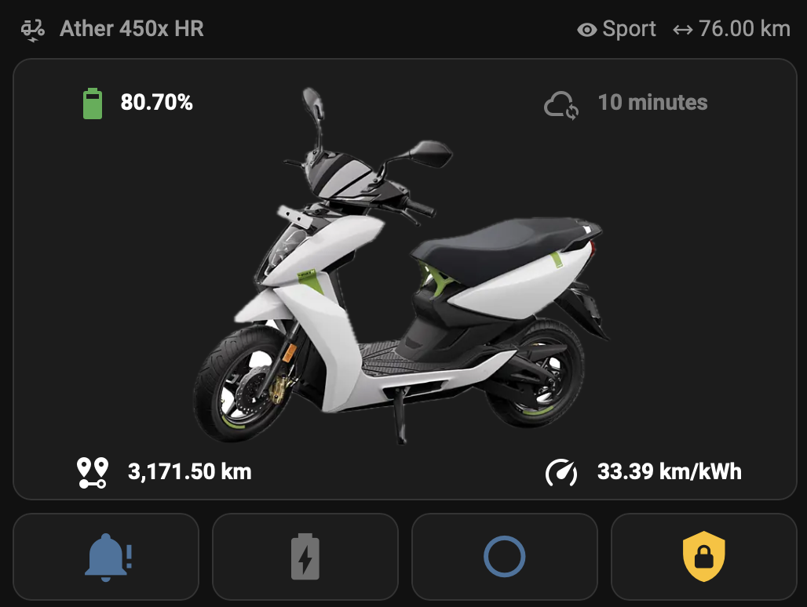

# Ather Electric Home Assistant Integration

Unofficial Home Assistant integration for Ather Energy electric scooters (450X, 450 Plus, etc.). This component allows you to monitor and control your scooter directly from Home Assistant.

## Features

- **Real-time Stats**: State of Charge (SoC), Range (Eco, Ride, Sport, Warp), Battery State, Charging Status.
- **Location Tracking**: Device tracker for scooter location.
- **Remote Controls**: (Experimental) Ping, Remote Charge, Shutdown (if enabled on your scooter/account).
- **Sensors**: Odometer, Trip details, Time remaining to charge.

## Installation

### HACS (Recommended)

1. Open HACS in Home Assistant.
2. Go to "Integrations".
3. Click the three dots in the top right corner and select "Custom repositories".
4. Add the URL of this repository.
5. Select "Integration" as the category.
6. Click "Add" and then install the integration.
7. Restart Home Assistant.

### Manual Installation

1. Download the `ather_electric` folder from the `custom_components` directory in this repository.
2. Copy the `ather_electric` folder to your Home Assistant `custom_components` directory.
3. Restart Home Assistant.

## Configuration

1. Go to **Settings** > **Devices & Services**.
2. Click **+ ADD INTEGRATION**.
3. Search for "Ather Electric".
4. Enter your Ather registered Phone Number, key* and OTP
> [!NOTE]
> _Required key is to identify Ather server, its avaialble in mobile app_
6. Follow the prompts to complete proper setup.

## Entities

The integration creates several entities including:
- `sensor.ather_soc`: Battery percentage.
- `sensor.ather_range_*`: Range estimates for different modes.
- `binary_sensor.ather_charging`: Charging status.
- `device_tracker.ather_scooter`: Location of the scooter.

## Disclaimer

This is an unofficial integration and is not affiliated with Ather Energy. Use it at your own risk.
